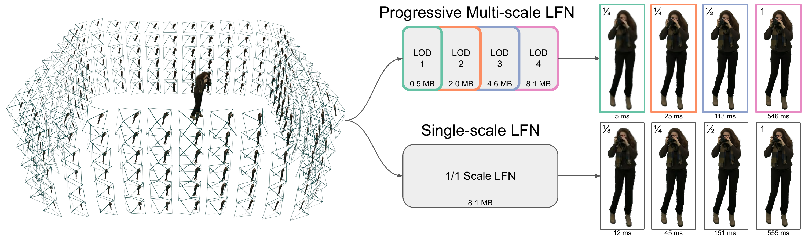
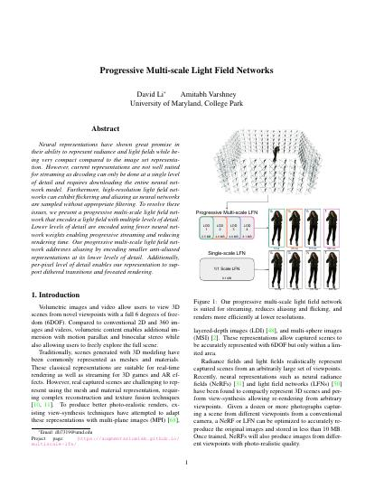
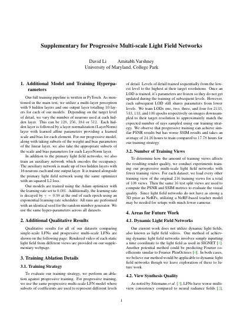
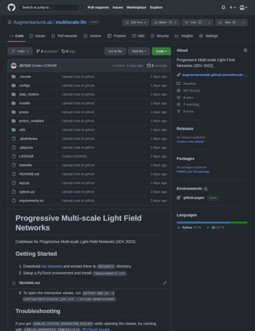

<style>
@media screen and (min-width: 64em) {
.main-content {
    max-width: 70rem;
}
}
.page-header{
background-color: #086375;
background-image: linear-gradient(120deg, #156064, #086375);
}
.erp_image {
    width: 12.4rem;
    object-fit: fill;
}
.main-content table th, .main-content table td {
    padding: 0;
}
.table_header td {
  text-align: center;
}
.comparison_table {
  border: 1px solid;
}
</style>

## Abstract

[](#)

Neural representations have shown great promise in their ability to represent radiance and light fields while being very compact compared to the image set representation. However, current representations are not well suited for streaming as decoding can only be done at a single level of detail and requires downloading the entire neural network model. Furthermore, high-resolution light field networks can exhibit flickering and aliasing as neural networks are sampled without appropriate filtering. To resolve these issues, we present a progressive multi-scale light field network that encodes a light field with multiple levels of detail. Lower levels of detail are encoded using fewer neural network weights enabling progressive streaming and reducing rendering time. Our progressive multi-scale light field network addresses aliasing by encoding smaller anti-aliased representations at its lower levels of detail. Additionally, per-pixel level of detail enables our representation to support dithered transitions and foveated rendering.

## Downloads

<div style="display: flex; text-align:center; flex-direction: row; flex-wrap: wrap;">
<div style="margin:1rem; flex-grow: 1;"><a href="#" onclick="return false;"><br>Paper (coming soon)</a><br></div>
<div style="margin:1rem; flex-grow: 1;"><a href="#" onclick="return false;"><br>Supplementary (coming soon)</a></div>
<div style="margin:1rem; flex-grow: 1;"><a href="https://github.com/AugmentariumLab/multiscale-lfn"><br>Code</a></div>
</div>

## Rendered Examples

<div class='container'>
  <a href="multiple_lfn_comparison.html" rel="noopener noreferrer">See also Multiple LFNs vs Multi-scale LFNs</a>
  <br>
  <table class="comparison_table" cellspacing="3">
    <tr class="table_header">
      <td>
        Model
      </td>
      <td>
        LOD 1 (1/8 scale)
      </td>
      <td>
        LOD 2 (1/4 scale)
      </td>
      <td>
        LOD 3 (1/2 scale)
      </td>
      <td>
        LOD 4 (1/1 scale)
      </td>
    </tr>
    <tr>
      <td>Single-scale LFN</td>
      <td><video muted autoplay loop class="erp_image">
        <source src="resources/videos/dataset1/fullscale_r8.mp4" type="video/mp4">
      </video></td>
      <td><video muted autoplay loop class="erp_image">
        <source src="resources/videos/dataset1/fullscale_r4.mp4" type="video/mp4">
      </video></td>
      <td><video muted autoplay loop class="erp_image">
        <source src="resources/videos/dataset1/fullscale_r2.mp4" type="video/mp4">
      </video></td>
      <td><video muted autoplay loop class="erp_image">
        <source src="resources/videos/dataset1/fullscale_r1.mp4" type="video/mp4">
      </video></td>
    </tr>
    <tr>
      <td>Multi-scale LFN</td>
      <td><video muted autoplay loop class="erp_image">
        <source src="resources/videos/dataset1/multiscale_r8.mp4" type="video/mp4">
      </video></td>
      <td><video muted autoplay loop class="erp_image">
        <source src="resources/videos/dataset1/multiscale_r4.mp4" type="video/mp4">
      </video></td>
      <td><video muted autoplay loop class="erp_image">
        <source src="resources/videos/dataset1/multiscale_r2.mp4" type="video/mp4">
      </video></td>
      <td><video muted autoplay loop class="erp_image">
        <source src="resources/videos/dataset1/multiscale_r1.mp4" type="video/mp4">
      </video></td>
    </tr>
    <tr>
      <td>Single-scale LFN</td>
      <td><video muted autoplay loop class="erp_image">
        <source src="resources/videos/dataset2/fullscale_r8.mp4" type="video/mp4">
      </video></td>
      <td><video muted autoplay loop class="erp_image">
        <source src="resources/videos/dataset2/fullscale_r4.mp4" type="video/mp4">
      </video></td>
      <td><video muted autoplay loop class="erp_image">
        <source src="resources/videos/dataset2/fullscale_r2.mp4" type="video/mp4">
      </video></td>
      <td><video muted autoplay loop class="erp_image">
        <source src="resources/videos/dataset2/fullscale_r1.mp4" type="video/mp4">
      </video></td>
    </tr>
    <tr>
      <td>Multi-scale LFN</td>
      <td><video muted autoplay loop class="erp_image">
        <source src="resources/videos/dataset2/multiscale_r8.mp4" type="video/mp4">
      </video></td>
      <td><video muted autoplay loop class="erp_image">
        <source src="resources/videos/dataset2/multiscale_r4.mp4" type="video/mp4">
      </video></td>
      <td><video muted autoplay loop class="erp_image">
        <source src="resources/videos/dataset2/multiscale_r2.mp4" type="video/mp4">
      </video></td>
      <td><video muted autoplay loop class="erp_image">
        <source src="resources/videos/dataset2/multiscale_r1.mp4" type="video/mp4">
      </video></td>
    </tr>
    <tr>
      <td>Single-scale LFN</td>
      <td><video muted autoplay loop class="erp_image">
        <source src="resources/videos/dataset3/fullscale_r8.mp4" type="video/mp4">
      </video></td>
      <td><video muted autoplay loop class="erp_image">
        <source src="resources/videos/dataset3/fullscale_r4.mp4" type="video/mp4">
      </video></td>
      <td><video muted autoplay loop class="erp_image">
        <source src="resources/videos/dataset3/fullscale_r2.mp4" type="video/mp4">
      </video></td>
      <td><video muted autoplay loop class="erp_image">
        <source src="resources/videos/dataset3/fullscale_r1.mp4" type="video/mp4">
      </video></td>
    </tr>
    <tr>
      <td>Multi-scale LFN</td>
      <td><video muted autoplay loop class="erp_image">
        <source src="resources/videos/dataset3/multiscale_r8.mp4" type="video/mp4">
      </video></td>
      <td><video muted autoplay loop class="erp_image">
        <source src="resources/videos/dataset3/multiscale_r4.mp4" type="video/mp4">
      </video></td>
      <td><video muted autoplay loop class="erp_image">
        <source src="resources/videos/dataset3/multiscale_r2.mp4" type="video/mp4">
      </video></td>
      <td><video muted autoplay loop class="erp_image">
        <source src="resources/videos/dataset3/multiscale_r1.mp4" type="video/mp4">
      </video></td>
    </tr>
    <tr>
      <td>Single-scale LFN</td>
      <td><video muted autoplay loop class="erp_image">
        <source src="resources/videos/dataset4/fullscale_r8.mp4" type="video/mp4">
      </video></td>
      <td><video muted autoplay loop class="erp_image">
        <source src="resources/videos/dataset4/fullscale_r4.mp4" type="video/mp4">
      </video></td>
      <td><video muted autoplay loop class="erp_image">
        <source src="resources/videos/dataset4/fullscale_r2.mp4" type="video/mp4">
      </video></td>
      <td><video muted autoplay loop class="erp_image">
        <source src="resources/videos/dataset4/fullscale_r1.mp4" type="video/mp4">
      </video></td>
    </tr>
    <tr>
      <td>Multi-scale LFN</td>
      <td><video muted autoplay loop class="erp_image">
        <source src="resources/videos/dataset4/multiscale_r8.mp4" type="video/mp4">
      </video></td>
      <td><video muted autoplay loop class="erp_image">
        <source src="resources/videos/dataset4/multiscale_r4.mp4" type="video/mp4">
      </video></td>
      <td><video muted autoplay loop class="erp_image">
        <source src="resources/videos/dataset4/multiscale_r2.mp4" type="video/mp4">
      </video></td>
      <td><video muted autoplay loop class="erp_image">
        <source src="resources/videos/dataset4/multiscale_r1.mp4" type="video/mp4">
      </video></td>
    </tr>
    <tr>
      <td>Single-scale LFN</td>
      <td><video muted autoplay loop class="erp_image">
        <source src="resources/videos/dataset5/fullscale_r8.mp4" type="video/mp4">
      </video></td>
      <td><video muted autoplay loop class="erp_image">
        <source src="resources/videos/dataset5/fullscale_r4.mp4" type="video/mp4">
      </video></td>
      <td><video muted autoplay loop class="erp_image">
        <source src="resources/videos/dataset5/fullscale_r2.mp4" type="video/mp4">
      </video></td>
      <td><video muted autoplay loop class="erp_image">
        <source src="resources/videos/dataset5/fullscale_r1.mp4" type="video/mp4">
      </video></td>
    </tr>
    <tr>
      <td>Multi-scale LFN</td>
      <td><video muted autoplay loop class="erp_image">
        <source src="resources/videos/dataset5/multiscale_r8.mp4" type="video/mp4">
      </video></td>
      <td><video muted autoplay loop class="erp_image">
        <source src="resources/videos/dataset5/multiscale_r4.mp4" type="video/mp4">
      </video></td>
      <td><video muted autoplay loop class="erp_image">
        <source src="resources/videos/dataset5/multiscale_r2.mp4" type="video/mp4">
      </video></td>
      <td><video muted autoplay loop class="erp_image">
        <source src="resources/videos/dataset5/multiscale_r1.mp4" type="video/mp4">
      </video></td>
    </tr>
  </table>
</div>

## Citation

```bibtex
@inproceedings{Li2022Progressive,
  author={Li, David and Varshney, Amitabh},
  booktitle={2022 International Conference on 3D Vision (3DV)},
  title={Progressive Multi-scale Light Field Networks},
  year={2022},
  volume={},
  number={},
  pages={},
  doi={}
}
```

David Li, and Amitabh Varshney. Progressive Multi-scale Light Field Networks. In 2022 International Conference on 3D Vision (3DV).
